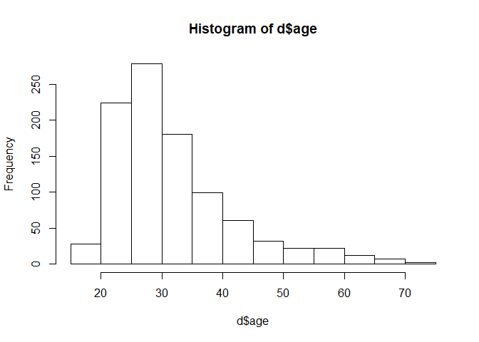
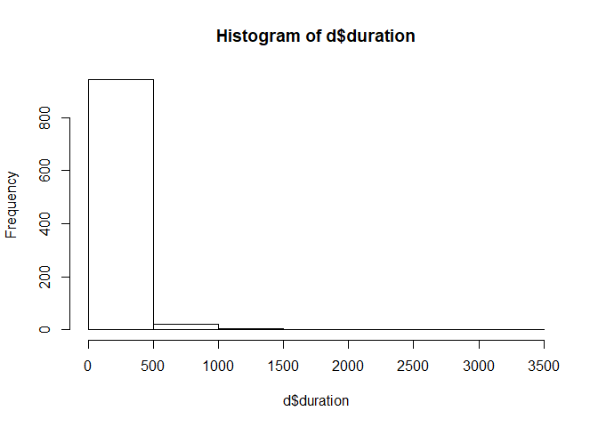

W241 Final Project Essay
================
Tucker Anderson, partnered with Carlos Sancini

## Cell Phone Mindfulness Study

### Background

Cell phone, or smart phone, usage has increased dramatically in the past
few years. Ownership has become so pervasive that now 96% of Americans
own a smartphone(<https://www.pewinternet.org/fact-sheet/mobile>). This
permutation of technology has had a tremendous impact the world over.
From browsing the internet to texting your friends to playing Candy
Crush, it’s easier than ever to pull your phone out of your pocket to
respond to an email or to try and quash that split second feeling of
boredom. Software is eating the world and the mobile platform is
providing users a limitless means to disconnect. This increased
connectivity to the web has some concerned that we may be spending too
much of our time and attention in the screens of our phones

The Screen Time application developed by Apple is included by default in
all iOS 12 and greater phones. This applications automatically tracks
the time and application use of the user, and seemed to be a great way
to measure our primary dependent variable of interest: time spent using
the phone each day or each week.

### Experimental Design

We designed a set of surveys to extract a sample of the population’s use
of cell phones. We isolated a subset of the population, only reaching
out to users who owned an Apple smartphone which had iOS 12 or higher
installed, to utilize the Screen Time app and ensure our measurement
methodology was consistent between all subjects. We believed the
consistent measurement benefit would outweigh the effects of leaving out
large subsets of the population such as Android phone users. The
assumption here is that there is no fundamental difference at the
population scale between Apple smartphone users and users of other
smartphone platforms. While it seems possible that there may be some

We ran a quick power analysis to determine the required amoung of
subjects in the control and treatment group. In this test we assumed a
minimum power of 0.80, as per Cohen’s reasoning that studies should have
a maximum Type II error rate of 0.20, and a significance level of 0.05
as per the standard practice of setting alpha Type I error rates to
0.05. We worried that the effect size of “mindfulness” of screen time
could be very small

``` r
# determine sample size required to achieve a power of 80% (Tpe II error rate of 20%) and a Type I error rate of 5% with a negligible effect size
pwr.t.test(d = 0.3, sig.level = 0.05, power = 0.80)
```

    ## 
    ##      Two-sample t test power calculation 
    ## 
    ##               n = 175.3847
    ##               d = 0.3
    ##       sig.level = 0.05
    ##           power = 0.8
    ##     alternative = two.sided
    ## 
    ## NOTE: n is number in *each* group

We see based on our power calculation that, assuming our effect size
would be about 0.3, we would like to achieve a sample size of about 175
for each group, or about 350 total subjects with a perfect 50/50 split.
However, our team foresaw a large attrition bias from subjects in this
study, it’s always hard to get the same subjects to respond to a similar
survey after one and especially two weeks. Considering this, with an
expectation of a possible 25% attriton rate between weeks, we would like
to generate survey responses from 437 participants, rounding up to a
clean 500. Accounting for attrition in this way will hopefully keep our
statistical power through the weeks, but it still leaves the possible
bias of those attriting due to some inexplicable difference between the
rest of subjects. Perhaps those who attrit naturally use their phone
less or are more perceptible to our treatment. This is something to keep
in mind for our analysis.

We also had concerns about compliance; would our subjects properly read
the articles given to them? Would treatment subjects properly read their
articles? We wanted to use Qualtrics’ timing feature and link clicking

### Issues Conducting Experiment

Unfortunately, we were not able to successfully conduct our study as
specified above. Amazon’s Mechanical Turk suspended our academic and
personal accounts for PII violations (but as of 8/13/19 still have not
provided what part of the survey questions were deemed to be in
violation) and non-American account statuses. Attempting to
reconsolidate these issues took weeks off of our schedule and eventually
only allowed us to collect partial baseline data three times. In light
of this, no true treatment (re-surveying after patients read an article
about the benefits of mindfulness of cell phone use) was administered
and no effect from our original design can be extracted.

### Data Analysis

``` r
# ingest data into a data table
d <- fread('./data/phone_data.csv')
head(d)
```

    ##    study.num duration      lat      long screentime work.phone
    ## 1:         1      379 34.00320 -117.9617        Yes        Yes
    ## 2:         1      292 37.38251  -79.2181        Yes         No
    ## 3:         1      318 39.73900  -84.0856        Yes        Yes
    ## 4:         1      147 32.89290  -80.0458        Yes         No
    ## 5:         1      301 35.76140  -78.6015         No         No
    ## 6:         1      499 30.33881  -97.5323        Yes         No
    ##                                  phone.provided gender age
    ## 1:                                           No Female  25
    ## 2:                                           No   Male  63
    ## 3: Yes, but not including cellular network fees   Male  26
    ## 4:                                           No Female  30
    ## 5:                                           No   Male  41
    ## 6:                                           No Female  23
    ##    employment.status employment.type minutes.day minutes.week
    ## 1:         Full time     Blue Collar           2            4
    ## 2:         Full time     Blue Collar           7            0
    ## 3:         Part time    White Collar         340          600
    ## 4:         Full time    White Collar         215         2536
    ## 5:         Full time     Blue Collar         384         2718
    ## 6:        Unemployed      Unemployed          47          456

``` r
d.size <- dim(d)
```

We ended up with 967 records

### EDA

``` r
# d[, location := revgeocode(c(long, lat))]
# note that Goolge API key needs to be registered with register_google() before this function works
revgeocode(c(d$long[400], d$lat[400]))
```

    ## Source : https://maps.googleapis.com/maps/api/geocode/json?latlng=28.55039978,-81.1832962&key=xxx-Y

    ## Multiple addresses found, the first will be returned:

    ##   606 Waterland Ct, Orlando, FL 32828, USA

    ##   Alafaya, FL 32828, USA

    ##   Orange County, FL, USA

    ##   Florida, USA

    ##   United States

    ## [1] "606 Waterland Ct, Orlando, FL 32828, USA"

``` r
hist(d$age)
```

<!-- -->

``` r
hist(d$duration)
```

<!-- -->

### Conclusion

Despite not being able to conduct a true field experiment, we were able
to gather a large baseline dataset of iOS users with their screentime
and a number of useful covariates.
